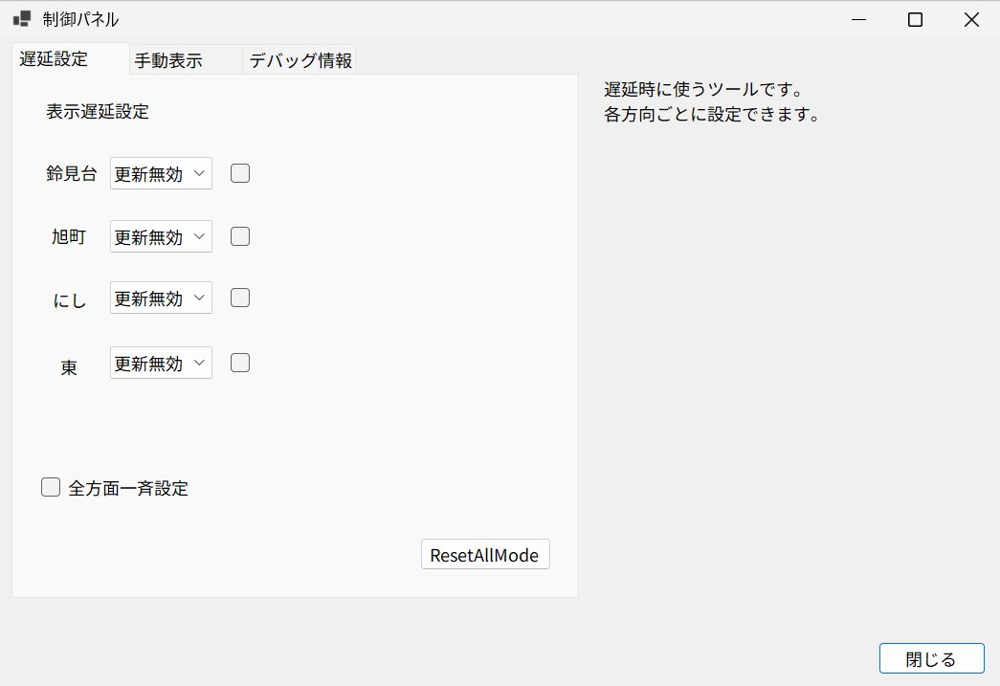
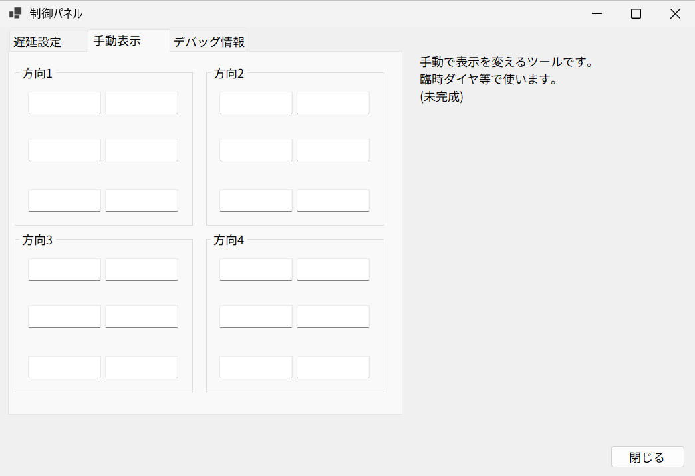
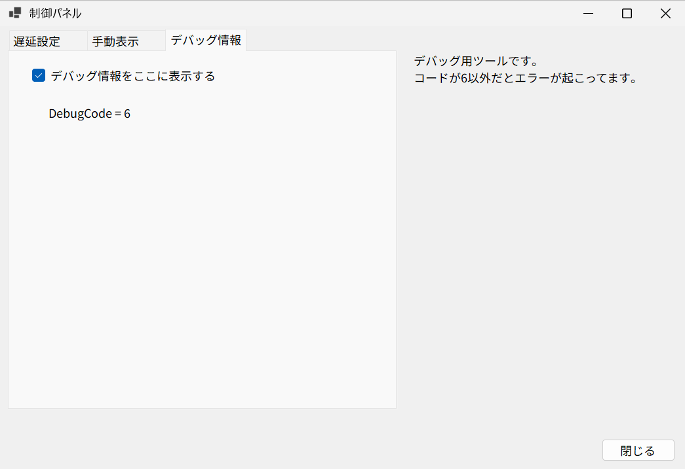
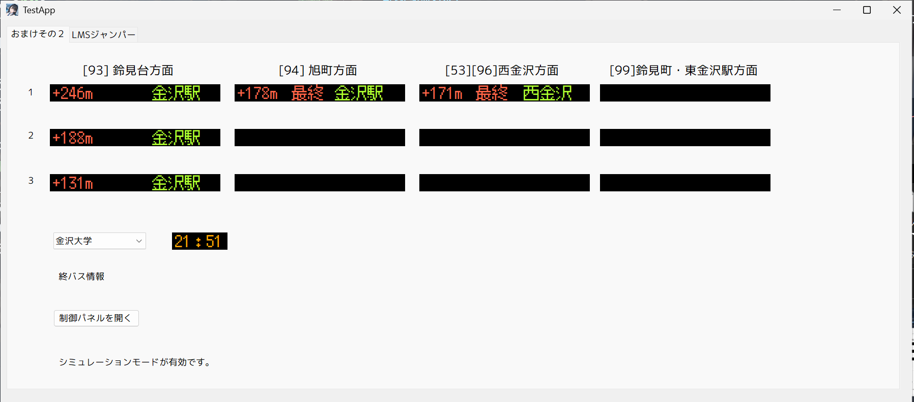
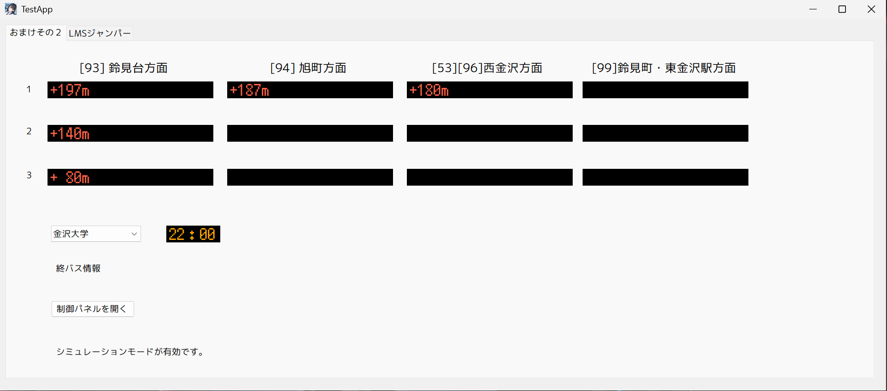
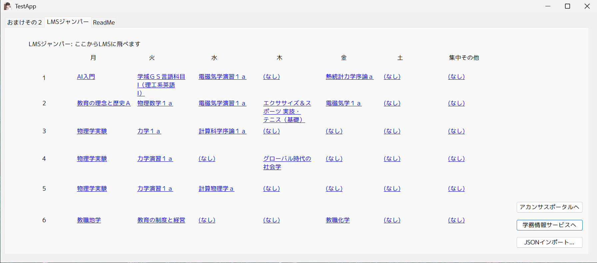
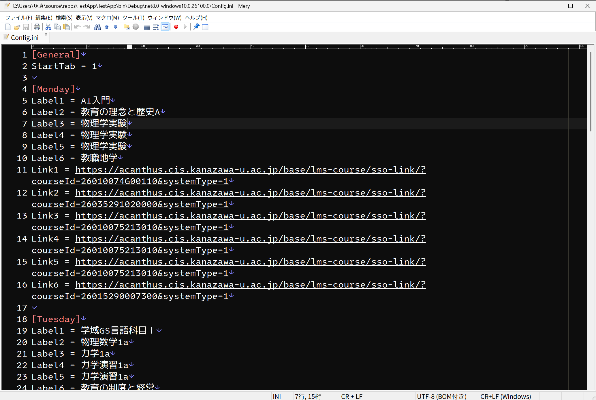
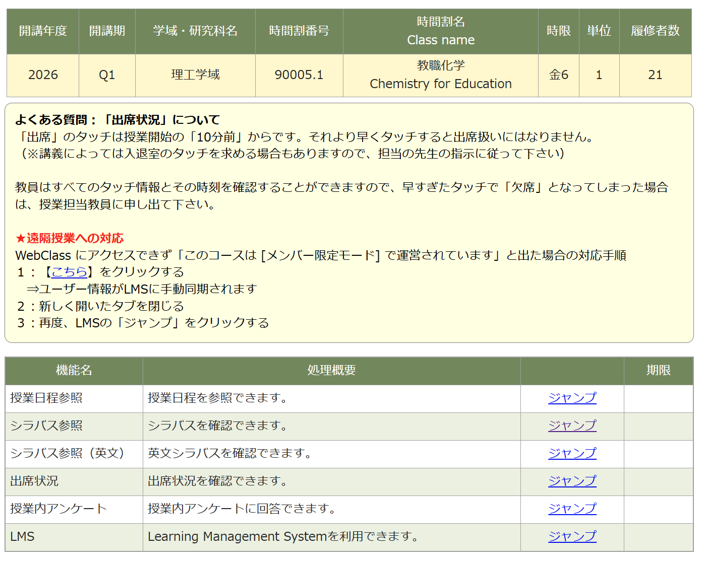
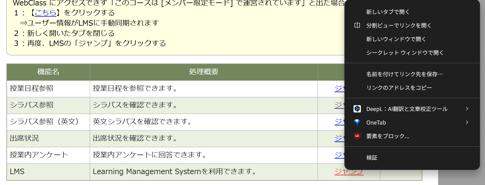

# TestApp 

趣味のためのツール。Created by T_Suzuki
<br>4つのツールが現状用意されている。

>p.s. これをVSCode拡張機能でPDF化したのでそっち見よう。

# 1. 簡易式バス発車表示版 - 金沢大学Edition / Simple Bus Departure Panel for Kanazawa University | ver. 3.0.d4
趣味とばかりに勝手に作ったツール。<span style="color:#ffa300">~~あまり役に立たない~~</span>

## 使い方 / How to use
現状「TestApp.exe」となっているファイルを起動するだけ。方面別に次はどの便が出るかが表示される。
なお、何も出なければ(少なくとも直通[^1](#1)では)その日運転される便がないことを表す。

なお、3つあるバス停にそれぞれ対応し、プルダウンメニューから変更できる。
>[!NOTE]
>現状の対応バス停は次の通り。
>* 金沢大学
>* 金沢大学中央
>* 金沢大学自然研前
>
>これ以外は非対応。

## 制御パネル / Control systems
制御パネルでは次のことができる。ただし開発中で未実装の機能が含まれる。

### 遅延対応パネル


トグルスイッチもしくはプルダウンメニューを操作し、遅延時に未到着のバス情報が消滅することを防ぐ。仕様としては、その方向の現在時刻の更新を止める形で実装している。

### 手動設定パネル

未実装だが、ここに手動で情報を入れることで表示板に反映させるようにする予定。

### デバッグ用ツール

デバッグ用ツールを設定する。
* デバッグコード表示 (未完成)
* ~~バックグラウンド動作の情報表示~~ (未実装)
* ~~表示変化情報の表示~~ (未実装)

>[!IMPORTANT]
>デバッグコードは問題が発生していると判断したため、近日修正予定である。

### Raw Data of HTML
デバッグ用ツール。内蔵Readmeに問題が発生したら、ここから問題のある部分を考える。


## 技術仕様 / Internal systems
バス時刻表は手打ちで入力しており、例えば
```C#
Buslist[94].Details.Add(new Details(940501, 08, 43, false, 94, 0, 0, 0, 52));
```
のように記述する。前から順に
ID、時、分、(特に意味はない)、系統番号、(廃止)、(廃止)、(廃止)、方向コード、(学期休み期間運休の場合ここにtrue)を格納する。

このコードを前から検索し、現在時刻より後で最も近いものから3つを抽出する。

休日判定は曜日からの他、HolidayJpを用いて祝日を判定し、休日とした。

## 更新記録 / Developping Logs
v1.0.00 実装<br>
v1.0.01 元のラベルテキストが残る不具合を修正。<br>
v1.0.02 金大にある3つの停留所に対応。<br>
v1.1.00 朝4時にならないとその日の時刻表が出ないようになったのと、終電情報が然るべきときに出るようにした。<br>
v1.2.00 1分ごとに更新するようになった。<br>
v2.0.β1 デザイン更新、学期休みダイヤ対応、最終表示仮実装。<br>
v2.0.00 休日ダイヤ対応（判定にはHolidayJpを採用）、その日の時刻表を出す時間を2時~に緩和。<br>
v2.0.01 UI改善、分ごとの更新に問題があったため修正。<br>
v3.0.d1 制御フォームの生成、Form1の変数とのリンク完了。<br>
v3.0.d2 制御システム仮完成<br>
v3.0.d3 仮置きアイコンを用意した。<br>
v3.0.d4 終電情報廃止、UI改善を実施。<br>
        ダイヤ改正に合わせて、時刻表定義部分を変更:<br>
    平日93: 増発:  8:32(52), 16:35(52)<br>
    平日94: 増発: 12:50(05), 14:40(55)<br>
    　　    　 変更: 16:55→17:00(52)<br>
    　　    　 廃止: 21:05(05)<br>
    平日53: 変更:  8:30→ 8:40(53)
, 13:05→13:30(53)
, 14:22→14:20(53)
, 19:25→19:20(53)<br>
    平日99: (変更なし)<br>
<br>
    休日93: 変更:13:45→13:50(52)
, 14:35→14:40(52)<br>
    休日94: (変更なし)<br>
    休日53: 変更: 16:55→16:30(53)
, 18:55→19:00(53)<br>
<br>
Yahoo!乗換案内がダイヤ改正に対応済みであることを確認し、照らし合わせて実装。<br>
v3.0.5 シミュレーションモード仮実装。現在時刻、内部時刻を変更できる。コンパイル時に設定が必要になるが、今後これは改善予定。
<br>遅延時の表示を仮実装。出発時刻の代わりに遅延時間t(単位:分)が、t>=5を満たすとき表示される。<span style=color:#ffaaaa>例えば下の画像のような地獄の状況も作れる。</span>

なんなら運転取りやめの処理まで作ってしまった。現在はコンパイル前に指定しなければならないが。なお、新幹線で同様の状況になった時の表示に発想を得て実装。


# 2. LMSジャンパーC# / LMS Jumper C# Edition
<span style=color:#44ccff>#LMS改悪やめろ</span> <br>


2026年3月に行われたメンテナンスにより、LMS
コースページから各教科のLMSへのアクセスが不可能になった。現在、アクセス手段が次のとおりとなった。
```
学務情報サービス→履修・成績情報→履修時間割表→各教科を選択→LMSへジャンプ
```
これは非常に<u>手間がかかる</u>上、時期によっては<span style=color:#aaaaaa>(~~ただでさえ履修登録で混み合ううえで~~)<span style=color:#ff7777>学務情報サービスへのアクセス集中によってLMSアクセス<u>**そのもの**</u>が困難な状況に陥った</span></span>事もあり、現在進行系で多くの学生を苦しめている。しかも過去のLMSは見れなくなったし。<span style=color:#aaaaaa>~~(学務はLMS改善の方向性(すなわち**ベクトルの向き**)を間違えたのである)~~</span><br>
せめてアクセス性だけは担保しようと、LMSへジャンプするURLを抽出し、そこからリンクを踏むと直接LMSへアクセスできることから、このシステムを用意した。自らのプログラミングの技量の向上とともに、先駆者様のツール(LMS jumper | https://univ.ichihai.dev/LMS-jumper/)を参考にC#を用いたWindows用ソフトの開発を目標とした。<br>


>[!TIP]
>正直のところ、URLを手動でコピペするのは大変という方に、こちらがおすすめ。<br>
>#バイバイ金大LMS (https://github.com/ogawa3427/goodByeLMSPage) 
><br>こちらは学務情報サービスの履修時間割表を開くと情報を取得でき、LMSコースページに表示してくれるという素晴らしいツール。感謝して使いましょう。
>なお、同機能のエクスポートファイルを読み込むコードを実装しました。

## 使い方 / How to Use


教科名を押すことでその教科のLMSにアクセスできる。右下のボタンはラベルの通り動作する。

## 内部仕様 / Internal systems

時間割を次のコードで定義~~する~~していた。
```C#
DataList[3, 0] = (new LMSData(3, 0, "(なし)", "-1"));
```
ここでDataListのindexは[曜日, 時限]であり、内部データは(曜日,時限,講義名,リンクとなるURL)である。

しかし、それだと非プログラマーが設定をいじれない(理由: 内部コードに入れてしまったから。こうなると、使用者にVisual Studioを導入してもらい、設定をいじってコンパイルしてもらわなければいけない。個人で使うのはまだしも、誰かに配るとなるときつい)

そこで、設定ファイル "Config.ini" が用意された。~~実装大変だった~~
<br>~~おそるおそる~~中身を開くと、次のようになっている。


<br>ここで、StartTabで起動時のタブを選択する。0-index方式でバスツール、LMS、説明書(?)となっている
<br>[Monday]などと曜日か書いてある以下に、LabelとLinkが6つずつあるので、1~6時間目に対応させて書く。例: 火3に力学1aがあるとすると、[Tuesday]以下のLabel3に力学1aと、Link3に入手したURLを入れる。取得方法は下のNoteを見ること。
<br>集中講義は[Other]を用いること。ただし、順番は問わない。

<br>

>[!TIP]
>
>#バイバイ金大LMS でエクスポートできるファイルを読み込んで設定することができる。<br>
>1. JSONインポートを押す
>2. ダイアログが出てくるので、該当ファイル goodByeLMS_allLectureData.json を選択し、開く
>3. データが登録されます
>

>[!NOTE]
>手動でURLを取得する場合は、次の手順に従う。
>* 各教科で「選択代行機能」にアクセス。図は「教職化学」。
>
>* LMSの「ジャンプ」を右クリックし、URLをコピーする。画像はchromeだが、「リンクのアドレスをコピー」でコピーできる。
>
>* 取得したデータを設定ファイルに登録する。

>[!WARNING]
>LMS画面を出している時のリンクを登録すると、一定条件下(ログインが外れた状態など)でWebClassのログイン画面になる。こうなると結局学務情報サービスに行かなければならないので登録しないこと。


設定ファイル内のデータを用いて、リンク付きのUIを構築し、デフォルトでは引数としてURLを渡してChromeを実行する仕組みである。FireFox等でも同様にできると思われるが、変更する場合はブラウザーごとにこの辺の仕様を確認し、実行ファイルのパスを特定して、ブラウザのパス部分を置き換えること。
```C#
 System.Diagnostics.Process.Start("C:\\Program Files\\Google\\Chrome\\Application\\chrome.exe", "--disable-features=ExtensionManifestV2Unsupported,ExtensionManifestV2Disabled" + DataList[Weekday, Time].URL);
```
上のコードの
```C#
"C:\\Program Files\\Google\\Chrome\\Application\\chrome.exe"
```
を書き換える。
```C#
"--disable-features=ExtensionManifestV2Unsupported,ExtensionManifestV2Disabled"
```
はChrome以外の場合消すこと[^2](#2)。


## 更新記録 / Developping Logs
v1.0.0 実装<br>
v1.1.0 Chromeでv2拡張機能を使うために必要なコマンドライン引数を追加。<br>
v2.0.0 外部ファイル "Config.ini" を用いてLMSデータを読み込みできるようになった。実行ファイル(.exe)と同じフォルダに作られます。<br>
v3.0.0 ~~#バイバイ金大LMS (https://github.com/ogawa3427/goodByeLMSPage) でエクスポートできるgoodByeLMS_allLectureData.jsonの読み込み機能を実装。<br>
v3.0.d1 右クリックメニューを実装。設定へのアクセスがやりやすく。なお、リンクに飛ぶ条件を左クリックのみとした。

# 3. FileClipper

LMSでファイルをアップロードして提出したい。だけど、このファイルどこに行ったっけ？　という問題を解消するツールとして実装。

## 仕様
ファイルをドラッグアンドドロップするとそのファイルパスがリストに登録される。<br>
ダブルクリックでファイルの場所を開く。<br>
項目を選択した状態で「Open」でファイル自体を開き、「Remove」でリストから削除できます。「Export」をおすとリストがテキストファイルとしてドキュメントフォルダに保存できます。ただし、インポートは未実装。
>[!IMPORTANT]
>ソフトを閉じると登録したファイルが消えます。ご注意ください。

## 更新記録
ver 1.0.0 実装

# 4. TextMemo

なんかメモ帳を出すまででもないけどメモしたい...そんな時に使える。
こちらもソフトを閉じると内容は消えるが、エクスポートできる。

# 5. Web (Beta)
Javascript実験用のページ。これまでに
* パスワード自動入力＋ボタンクリックイベント発生
* 出席情報をテーブルから取得

機能を実装。

## 更新履歴
v1.0 もともとReadMeにしたやつを改変して実装。<br>
v1.1 出席情報のページが共通だったため、取得したいクォーターを選択し、それだけ取得するように変更。また、ページのセッション有効期限切れの問題に対処。このためのリロードボタンを実装。

# 6. BatteryStatus
これを使うような人たちはたいてい学校に持ち込んだノートPCであろうから、そのためのツール。バッテリーの充電のみならず、現在の変化量、バッテリー消耗度を計算できるようになっている。また、バッテリー充電が減少し始めたときのメッセージボックスも実装済み。

# 動作環境 / Running Environment
OS: Windows<br>
Framework: .NET 8.0 (ランタイムパッケージを導入しましょう)<br>
TargetOSVersion: 10.0.22600.0<br>
SupportOSVersion: 10.0.17763.0 (Windows 10 初期バージョン)

# 今後の展望 / Future Construction Functions
## バス時刻板
* 手動で表示を変える機能の内部実装
* シミュレーションモードのGUIでの変更
* シミュレーションモードの柔軟性向上(例えば、表示時刻のみ実際のものに従うなどの処置。)

## LMS

とりあえずこれで快適に使える状態にはなった。後は保守点検等になる。<br>
気が向けば、以下の要素を追加:
* シラバスリンクの追加・保存。
* 選択代行機能にアクセスする。
* アカンサスポータル・LMSコース・学務情報サービスへのアクセスリンクを貼る。
* 任意のブラウザーで開けるように設定。

***

<span id=1 style="font-size:x-small">1: 何も表示されない場合でも、他のバス便もしくは電車を用いて到達可能な場合がある。ただし、21時以降では厳しい場合がほとんど。</span><br>
<span id=2 style="font-size:x-small">2: これは無効化されたManifest V2型Chrome拡張機能(ex: uBlock Origin)を無理やり有効化するツール。Chrome以外では必要ない。</span>

# クレジット / Credits

* 効果音：ポケットサウンド – https://pocket-se.info/
* VSQPlus - https://vsq.co.jp/plus/


## 誰かによる手記

>何か改悪が行われた時、そこには被害を受けた人たちがいて、そうした人々のため、自身の持つ能力をもって状況を打開する人も現れる。そうして、便利なツールができていった。改悪による"絶望の日"は、有志たちの"決起の日"となったわけである。<br>
>
>ある者は、いずれこうなるという「予知夢」に従ってツールを作っていたという。そして今、それは画期的なツールとなった。またある者は、この改悪を受けてWebツールを作った。しかし私は「Windowsのソフトとして動くツールにできるだろう」と思い立って、~~変な~~バス系ユーティリティだけだった、このソフトに付け足した。
>
>始めは内部に定義コードを埋め込んだ。しかしそれでは変更の際に毎回コンパイルしないといけないと言って、.iniファイルにデータ保管を任せた。ただ、今度はURLの取得がめんどくさいな、でもこればっかりはきついなと思っていた。
>
>しかし、あるツール(ブラウザー拡張機能)はこれを自動取得できるうえで、エクスポートできると来た。これはインポートを実装しなければと思った。
>
>しかし、.jsonファイルのデシリアライズに苦戦し、1週間ほどたって、ようやくそれは実現した。今やこのツールは、思ったより素晴らしいツールになった。当分は、これが"私にとっての"LMSコース画面となる。何回もいろんなところを経由しなくて良い。ソフトを立ち上げ、リンクをクリックし、ログインするだけ。少し頑張って導入さえすれば、これからは3ステップでLMSを使える。アカンサスポータルも、学務情報サービスも圧迫しない。非常に楽である。
>
>これが、私なりの”LMS”だ。
>
>p.s. アカンサスポータル死んだら使えない気がしてきた
>
> T_Suzuki 2026/04/18
